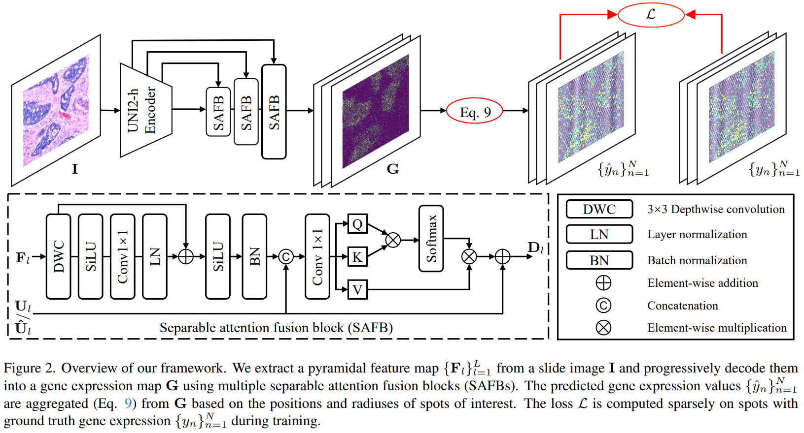

# From-Spots-to-Pixels

<p align="center">
    
</p>

### [[Paper]()][[arxiv](https://arxiv.org/abs/2503.01347)]
[Ruikun Zhang](https://scholar.google.com/citations?user=8rabqgoAAAAJ&hl=en), [Yan Yang](https://scholar.google.com/citations?user=IF0xw34AAAAJ&hl=en), and [Liyuan Pan](https://scholar.google.com/citations?user=kAt6-AIAAAAJ&hl=en)\*

> **Abstract:**  Spatial transcriptomics (ST) measures gene expression at fine-grained spatial resolution, offering insights into tissue molecular landscapes. Previous methods for spatial gene expression prediction typically crop spots of interest from histopathology slide images, and train models to map each spot to a corresponding gene expression profile. However, these methods inherently lose the spatial resolution in gene expression: 1) each spot often contains multiple cells with distinct gene expression profiles; 2) spots are typically defined at fixed spatial resolutions, limiting the ability to predict gene expression at varying scales. To address these limitations, this paper presents PixNet, a dense prediction network capable of predicting spatially resolved gene expression across spots of varying sizes and scales directly from histopathology slide images. Different from previous methods that map individual spots to gene expression values, we generate a spatially dense continuous gene expression map from the histopathology slide image, and aggregate values within spots of interest to predict the gene expression. Our PixNet outperforms state-of-the-art methods on four common ST datasets in multiple spatial scales.




## 📑 Contents
code will be released later!

- [News](#news)
- [TODO](#todo)
- [Dataset](#dataset)
- [Results](#results)
- [Installation](#installation)
- [Training](#training)
- [Testing](#testing)
- [Citation](#cite)


## <a name="news"></a> 🆕 News


- **2025/3:** arXiv paper available.
- **2026/2:** Congratulations! Our paper has been accepted by **CVPR 2026**！🎉
- **2026/3:** This repo is released.


## <a name="todo"></a> ☑️ TODO

- [x] Build the repo
- [x] arXiv version
- [ ] Release training code
- [ ] Release dataset

## <a name="installation"></a> ⚙️ Installation

This codebase was tested with the following environment configurations:

- Ubuntu 20.04
- CUDA 11.7
- Python 3.9
- PyTorch 2.0.1 + cu117

### Previous installation
One can also create a new anaconda environment, and then install necessary python libraries with "./requirement.txt" and the following command: 
```
pip install -r requirements.txt
```


## <a name="cite"></a> 🥰 Citation

```
@article{zhang2025spots,
  title={From Spots to Pixels: Dense Spatial Gene Expression Prediction from Histology Images},
  author={Zhang, Ruikun and Yang, Yan and Pan, Liyuan},
  journal={arXiv preprint arXiv:2503.01347},
  year={2025}
}
```

## License

This project is released under the [Apache 2.0 license](LICENSE).

## Acknowledgement

The code is borrowed from the following repositories, thanks for sharing.
- [TRIPLEX]([https://github.com/XPixelGroup/BasicSR](https://github.com/NEXGEM/TRIPLEX))
- [SGN]([https://github.com/gladzhang/ART](https://github.com/Yan98/SGN))
- [MCADS-Decoder]([https://github.com/MzeroMiko/VMamba](https://github.com/saadwazir/MCADS-Decoder))

## Contact

Feel free to contact me at **ruikun.zhang@bit.edu.cn** if you have any questions.


